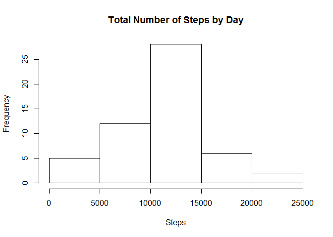
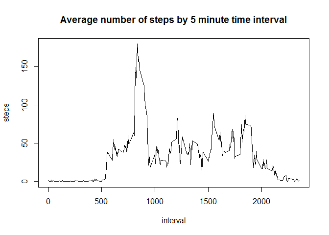
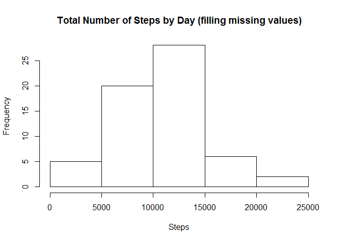
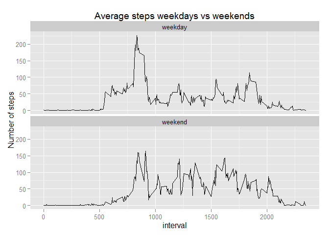

# Reproducible Research: Peer Assessment 1
Gill Griffiths  
Thursday, March 12, 2015  


```r
knitr::opts_chunk$set( fig.path='Figures/',
                      echo=TRUE, warning=FALSE, message=FALSE)
```


```r
setwd("C:/Users/Office/Documents/Coursera/Reproducible Research/Assignment 1")
library(dplyr)
library(reshape2)
library(ggplot2)
```

## Loading and preprocessing the data

```r
activity <- read.csv("activity.csv")
```


## What is mean total number of steps taken per day?
The total number of steps by day:


```r
totalStepsByDay <- activity %>% group_by(date) %>% summarise(steps=sum(steps))
hist(totalStepsByDay$steps,main="Total Number of Steps by Day",xlab="Steps")
```

 

```r
meanSteps <- summarise(totalStepsByDay, steps=mean(steps,na.rm=TRUE))
medianSteps <- summarise(totalStepsByDay, steps=median(steps,na.rm=TRUE))
```

The mean of the total number of steps by day is 1.0766189\times 10^{4}.  
The median of the total number of steps by day is 10765.


## What is the average daily activity pattern?

```r
activity1 <- activity
# Set any NA values to zero
activity1[is.na(activity1)] <- 0
averageDailySteps <- activity1 %>% group_by(interval) %>% summarise(steps=mean(steps))
plot(averageDailySteps,type="l",main="Average number of steps by 5 minute time interval")
```

 

```r
intMaxSteps <- averageDailySteps[ which.max(averageDailySteps$steps),1]
maxSteps <- averageDailySteps[ which.max(averageDailySteps$steps),2]
```

The interval which contains the largest number of steps (179.1311475) is interval 835.  


## Imputing missing values

```r
activity2 <- activity
countNA <- sum(is.na(activity2$steps))
activity2[is.na(activity2$steps),"steps"] <- averageDailySteps[match(activity2[is.na(activity2$steps),"interval"],
                                                                   averageDailySteps$interval),"steps"]
totalStepsByDay2 <- activity2 %>% group_by(date) %>% summarise(steps=sum(steps))
hist(totalStepsByDay2$steps,main="Total Number of Steps by Day (filling missing values)",xlab="Steps")
```

 

```r
meanSteps2 <- summarise(totalStepsByDay2, steps=mean(steps,na.rm=TRUE))
medianSteps2 <- summarise(totalStepsByDay2, steps=median(steps,na.rm=TRUE))
```

There are (2304) rows with missing values. 
  
Missing values have been replaced with the average for that interval and if all 
values for an interval are NA then they will be replaced by zero.
  
The new mean of the total number of steps by day is 1.0581014\times 10^{4}.  
The new median of the total number of steps by day is 1.0395\times 10^{4}.  
  
These new values for mean and median steps are less than the original ones. 
This is because in the original calculation NAs were ignored, which meant  
that fewer rows were included in the calculation and this had the effect of 
increasing the averages. Whereas replacing NA values with the average  
for the interval will result ensures that all rows are used in the calculation 
and this has the effect of decreasing the average.


## Are there differences in activity patterns between weekdays and weekends?

```r
activity2$day <- weekdays(as.POSIXlt(activity2$date,"%Y-%m-%d",tz="GMT"))
activity2$dayClassification[activity2$day %in% c("Monday","Tuesday",
  "Wednesday","Thursday","Friday")] <- "weekday"
activity2$dayClassification[activity2$day %in% c("Saturday","Sunday")] <- "weekend"                                  
activity2$dayClassification <- factor(activity2$dayClassification)
averageDailySteps2 <- activity2 %>% group_by(dayClassification,interval) %>% 
     summarise(steps=mean(steps))
qplot(interval, steps, data=averageDailySteps2,ylab="Number of steps",
      main="Average steps weekdays vs weekends",geom="line") + 
      facet_wrap(~dayClassification, ncol = 1, nrow = 2)
```

 
  
The graph shows that there are differences between weekdays and weekends.
For example, on a weekday the steps start earlier and finish sooner, 
indicating people getting up early for work and going to bed earlier,
whereas on a weekend they get up later and go to bed later.
